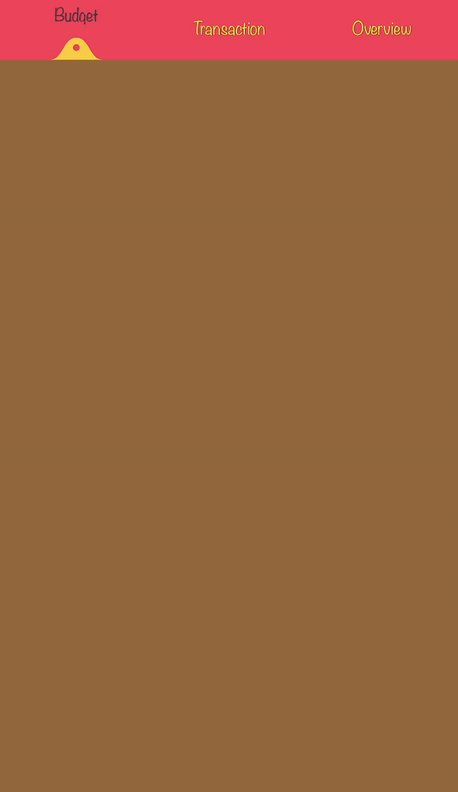
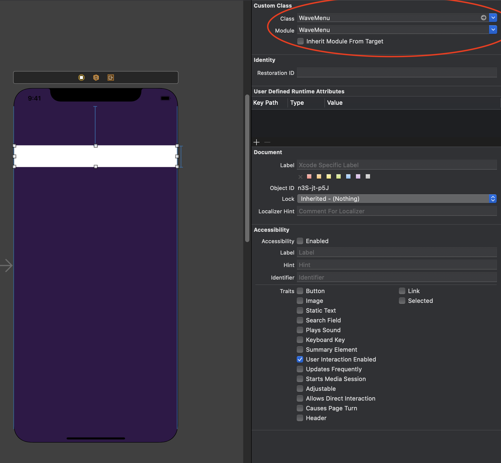

[](https://swift.org/package-manager/)

WaveMenu is an animated, custom menu view.  

## Demo
<p align="center">
  
</p>

## Requirements
* iOS 10.0+
* Xcode 11+
* Swift 5.2+

## Installation
WaveMenu is distributed with [Swift Package Manager](https://swift.org/package-manager/) which is the only official distribution tool by Apple. You can add WaveMenu to your project from Xcode's `File > Swift Packages > Add Package Dependency` menu with its github URL:
```
https://github.com/mobven/WaveMenu.git
```

## Usage

WaveMenu can initialize from storyboard or programmatically. WaveMenu gives an index of selected title attribute via `WaveMenuDelegate`, for doing this, `menuDelegate` has to set.

### Programmatically Initialize

- Create a WaveMenu instance and add as a subview.

  ```swift
    let topBar: WaveMenu = {
        let wm = WaveMenu()
        wm.backgroundColor = UIColor(red: 232/255, green: 35/255, blue: 55/255, alpha: 1.0)
        wm.titleNames = ["Budget", "Transaction", "Overview"]
        wm.curveWidth = 24
        wm.titleFont = UIFont(name: "Noteworthy-Light", size: 15)!
        wm.menuTitleTextColor = .init(white: 1.0, alpha: 0.6)
        wm.menuTitleSelectedTextColor = .white
        wm.curveFillColor = .white
        return wm
    }()
  ```
  ```swift
    override func viewDidLoad() {
        super.viewDidLoad()
    
       view.addSubview(topBar)
       topBar.menuDelegate = self
       // set constraints of topBar
    }
  ```
  

### Storyboard Initialization

<p align="center">
  
</p>

- Create a view from storyboard.
- Select view and set custom class in the identity inspector with `WaveMenu`.
- Can set @IBInspactable params in attribute inspector.
- Create an outlet and set attributes for WaveMenu instance.


## What's next
- [ ] New animations for curve.
- [ ] Unit Tests.

---
Developed with 🖤 at [Mobven](https://mobven.com/)
